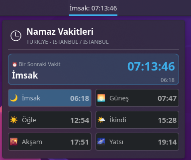
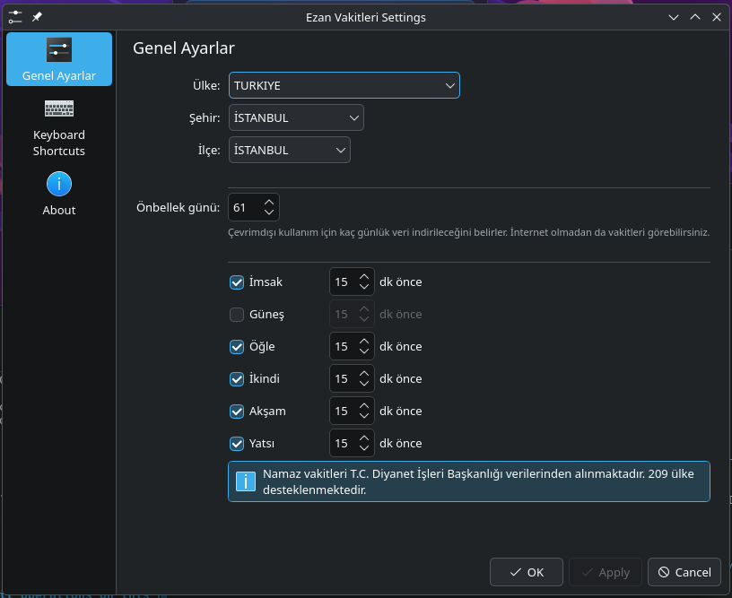

# KDE Plasma 6 Ezan Vakitleri Widget'ı

Bu widget, KDE Plasma 6 masaüstü ortamında namaz vakitlerini gösterir.

## Ekran Görüntüleri

### Masaüstü Görünümü


### Panel Görünümü


### Ayarlar


## Özellikler

✅ **Diyanet Resmi Verileri** - T.C. Diyanet İşleri Başkanlığı'ndan güncel namaz vakitleri
✅ **Offline Çalışma** - İnternet olmadan da kullanılabilir (7-365 gün arası önbellek, varsayılan 61 gün)
✅ **Akıllı Bildirimler** - Her vakit için ayrı bildirim süresi ayarlanabilir
✅ **Modern Gradient Tasarım** - Tema uyumlu (light/dark) bordo-mavi tonlarda şık görünüm
✅ **Güncel Namaz Vakitleri** - İmsak, Güneş, Öğle, İkindi, Akşam, Yatsı
✅ **Canlı Geri Sayım** - Bir sonraki vakite kalan süreyi saniye saniye gösterir
✅ **Akıllı Renkler** - Geçmiş ve gelecek vakitler farklı renklerde gösterilir
✅ **209 Ülke Desteği** - Tüm dünya ülkeleri
✅ **Dinamik Şehir ve İlçe Listesi** - Ülkeye göre otomatik yükleniyor
✅ **Hızlı Konum Seçimi** - Ayarlardan şehir değiştirince vakitler anında güncellenir
✅ **Performans Optimizasyonu** - Günde sadece 1 API isteği, minimal RAM/CPU kullanımı

## Kurulum

### GitHub'dan Kurulum

1. Repoyu klonlayın:
```bash
git clone https://github.com/necmettin1461/ezanvakti-widget.git
cd ezan-vakitleri-widget
```

2. Widget'ı kurun:
```bash
kpackagetool6 --type Plasma/Applet --install package
```

3. Plasma'yı yeniden başlatın:
```bash
killall plasmashell && kstart plasmashell
```

### Güncelleme

Eğer widget zaten kuruluysa, güncellemek için:
```bash
cd ezan-vakitleri-widget
git pull
kpackagetool6 --type Plasma/Applet --upgrade package
killall plasmashell && kstart plasmashell
```

### Manuel Kurulum (ZIP dosyasından)

1. Widget paketini indirin
2. Paketi kurun:
```bash
kpackagetool6 --type Plasma/Applet --install package
```

3. Plasma'yı yeniden başlatın:
```bash
killall plasmashell && kstart plasmashell
```

### Panel'e Ekleme

1. Panel'e sağ tıklayın
2. "Parçacık Ekle" seçeneğini seçin
3. "Ezan Vakitleri" widget'ını bulun ve ekleyin

## Yapılandırma

Widget'a sağ tıklayıp "Yapılandır" seçeneğini seçerek:

### Offline Önbellek Ayarı

Widget, internet bağlantısı olmadan da çalışabilmesi için namaz vakitlerini yerel olarak önbellekler.

- **Önbellek Günü**: 7-365 gün arası seçilebilir (varsayılan: 61 gün)
- Widget ilk açılışta veya konum değiştiğinde otomatik olarak verileri indirir
- İnternet olmadığında önbellekten çalışır
- İnternet varken arka planda güncelleme yapar

### Bildirim Ayarları

Her vakit için ayrı ayrı bildirim ayarlanabilir:

- **Vakit Seçimi**: Hangi vakitler için bildirim alacağınızı seçin (İmsak, Güneş, Öğle, İkindi, Akşam, Yatsı)
- **Süre Ayarı**: Her vakit için ayrı süre belirleyin (1-60 dakika)
- **Bildirim Mesajı**: "KARDEŞİM ÖNCE NAMAZ! Öğle vakti için 15 dk kaldı!"
- Varsayılan: Güneş hariç tüm vakitler için 15 dakika önceden bildirim

**Örnek:**
- İmsak: 30 dk önce
- Öğle: 20 dk önce
- İkindi: 15 dk önce
- Akşam: 10 dk önce
- Yatsı: 25 dk önce

### Ülke, Şehir ve İlçe Seçimi

1. **Ülke**: Dropdown'dan ülkenizi seçin
   - **209 ülke** destekleniyor
   - Türkiye, Almanya, Fransa, İngiltere, ABD, Japonya, Rusya ve daha fazlası
   - API'den dinamik olarak yüklenir

2. **Şehir**: Ülke seçtikten sonra, o ülkenin şehirleri otomatik yüklenir
   - Her ülkenin tüm şehirleri API'den çekilir
   - Türkiye için 81 il
   - Diğer ülkeler için ilgili şehirler

3. **İlçe**: Şehir seçtikten sonra, o şehrin ilçeleri otomatik yüklenir
   - İlçeler Diyanet API'sinden dinamik olarak çekilir
   - Eğer daha önce seçilen ilçe yoksa, ilk ilçe otomatik seçilir

### Veri Kaynağı

**Namaz vakitleri** T.C. Diyanet İşleri Başkanlığı'nın resmi verilerinden `ezanvakti.emushaf.net` API'si aracılığıyla alınmaktadır. Bu, `ezanvakti` uygulamasının kullandığı aynı veri kaynağıdır.

### Desteklenen Ülkeler

**209 ülke** destekleniyor! Örnek ülkeler:
- **Avrupa**: Türkiye, Almanya, Fransa, İngiltere, İtalya, İspanya, Hollanda, Belçika, Avusturya, Yunanistan, vs.
- **Asya**: Suudi Arabistan, BAE, Katar, Kuveyt, Japonya, Çin, Hindistan, Pakistan, Endonezya, vs.
- **Kuzey Amerika**: ABD, Kanada, Meksika
- **Afrika**: Mısır, Fas, Cezayir, Tunus, Libya, Güney Afrika, vs.
- **Diğer**: Avustralya, Yeni Zelanda, Brezilya, Arjantin, vs.

## Kaldırma

Widget'ı kaldırmak için:
```bash
kpackagetool6 --type Plasma/Applet --remove org.kde.plasma.necm1461.prayertimes
killall plasmashell && kstart plasmashell
```

## Lisans

GPL-3.0+
